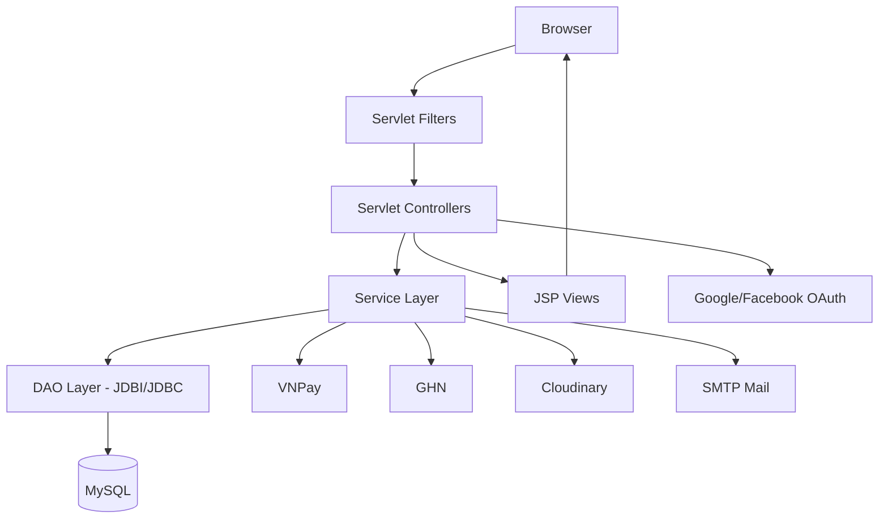
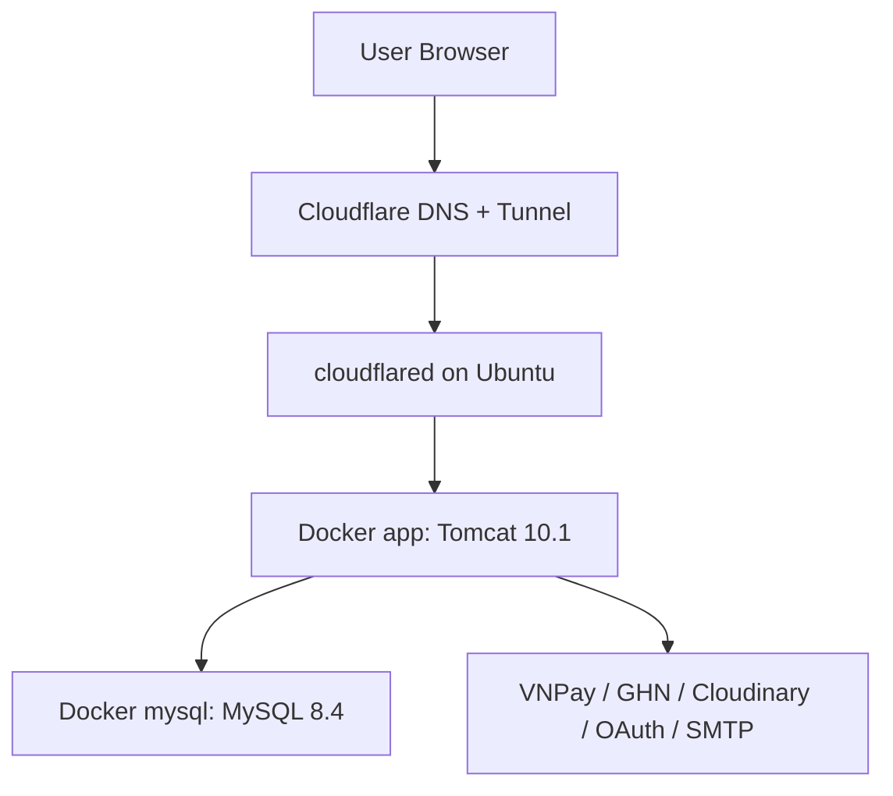

# Aura Studio - Fashion E-commerce Website

Aura Studio là website thương mại điện tử thời trang được xây dựng bằng Java Web truyền thống. Dự án sử dụng Jakarta Servlet/JSP, JSTL, JDBI, MySQL và được chuẩn hóa để triển khai bằng Docker Compose trên Ubuntu, chạy sau Cloudflare Tunnel.

Production domain:

```text
https://shop.nguyenhandeptrai.id.vn/
```

Ứng dụng được build thành `ROOT.war`, vì vậy khi deploy production các đường dẫn chạy ở context root:

```text
https://shop.nguyenhandeptrai.id.vn/home
https://shop.nguyenhandeptrai.id.vn/product
https://shop.nguyenhandeptrai.id.vn/order-user
```

Không dùng context cũ kiểu `/ShopQuanAo_war`.

## Mục Lục

- [Tổng quan](#tổng-quan)
- [Tính năng chính](#tính-năng-chính)
- [Công nghệ sử dụng](#công-nghệ-sử-dụng)
- [Kiến trúc hệ thống](#kiến-trúc-hệ-thống)
- [Cấu trúc thư mục](#cấu-trúc-thư-mục)
- [Cấu hình môi trường](#cấu-hình-môi-trường)
- [Chạy local bằng IntelliJ/Tomcat](#chạy-local-bằng-intellijtomcat)
- [Chạy bằng Docker Compose](#chạy-bằng-docker-compose)
- [Deploy Ubuntu + Cloudflare Tunnel](#deploy-ubuntu--cloudflare-tunnel)
- [Database](#database)
- [Build và kiểm tra](#build-và-kiểm-tra)
- [Ghi chú vận hành](#ghi-chú-vận-hành)

## Tổng Quan

Aura Studio mô phỏng một hệ thống e-commerce hoàn chỉnh cho cửa hàng thời trang, gồm website khách hàng và trang quản trị. Dự án tập trung vào các nghiệp vụ quan trọng như quản lý sản phẩm, biến thể sản phẩm, giỏ hàng, checkout, tồn kho, thanh toán, vận chuyển, đổi trả và phân quyền admin.

Repository:

```text
https://github.com/DucPhat0311/ThucTapWeb-2026
```

Thông tin chính:

| Mục | Nội dung |
| --- | --- |
| Tên dự án | Aura Studio |
| Loại dự án | Java Web Application |
| Java | Java 17 |
| Web stack | Jakarta Servlet, JSP, JSTL |
| Database | MySQL 8.4 |
| Data access | JDBC, JDBI |
| Build chính | Gradle Wrapper |
| Artifact deploy | `build/libs/ROOT.war` |
| Runtime production | Tomcat 10.1 JRE 17 |
| Deploy | Docker Compose |
| Public access | Cloudflare Tunnel |

## Tính Năng Chính

### Khách Hàng

- Đăng ký, đăng nhập, đăng xuất.
- Xác thực OTP qua email.
- Đăng nhập bằng Google OAuth và Facebook Login.
- Quản lý hồ sơ cá nhân, avatar, email, mật khẩu.
- Quản lý địa chỉ giao hàng.
- Xem danh sách sản phẩm, tìm kiếm, lọc sản phẩm, xem chi tiết sản phẩm.
- Chọn màu, size, số lượng theo biến thể sản phẩm.
- Thêm vào giỏ hàng, mua ngay, wishlist.
- Checkout bằng COD hoặc VNPay.
- Xem lịch sử đơn hàng và chi tiết đơn hàng.
- Theo dõi trạng thái vận chuyển.
- Hủy đơn theo điều kiện hợp lệ.
- Mua lại đơn hàng.
- Gửi đánh giá sản phẩm.
- Gửi yêu cầu trả hàng/hoàn tiền kèm hình ảnh hoặc video minh chứng.
- Nhận thông báo trong hệ thống.

### Quản Trị

- Dashboard thống kê doanh thu, đơn hàng và lợi nhuận.
- Quản lý sản phẩm, biến thể, hình ảnh, danh mục, màu sắc, kích thước.
- Quản lý người dùng, vai trò và quyền truy cập.
- Quản lý đơn hàng và trạng thái thanh toán.
- Tạo và cập nhật hành trình vận chuyển mô phỏng.
- Quản lý yêu cầu trả hàng, hoàn hàng và hoàn tiền.
- Quản lý nhập kho, xuất kho, hoàn kho.
- Quản lý banner, blog và liên hệ khách hàng.
- Bảo vệ route admin bằng `AdminAuthFilter`.

### Tích Hợp Bên Ngoài

- VNPay sandbox payment.
- GHN shipping API.
- Google OAuth.
- Facebook Login.
- Cloudinary upload ảnh/video.
- Gmail SMTP/Jakarta Mail cho OTP và email đơn hàng.

## Công Nghệ Sử Dụng

Backend:

- Java 17
- Jakarta Servlet 6
- JSP/JSTL
- JDBI 3
- MySQL Connector/J
- Jackson Databind
- Jakarta Mail
- BCrypt
- RestFB
- Cloudinary SDK
- Logback

Frontend:

- JSP/JSTL
- HTML, CSS, JavaScript
- Font Awesome
- Swiper

DevOps:

- Gradle Wrapper
- Dockerfile multi-stage build
- Docker Compose
- Tomcat 10.1
- MySQL 8.4
- Cloudflare Tunnel

## Kiến Trúc Hệ Thống

Luồng xử lý chính:



Mô hình production:



Cloudflare Tunnel trỏ về:

```text
http://localhost:8080
```

## Cấu Trúc Thư Mục

```text
.
├── database/
│   └── aurastudio.sql
├── src/
│   └── main/
│       ├── java/
│       │   ├── controller/
│       │   ├── dao/
│       │   ├── filter/
│       │   ├── model/
│       │   ├── service/
│       │   └── util/
│       ├── resources/
│       │   ├── db.properties
│       │   ├── google-oauth.properties
│       │   ├── local.properties.example
│       │   └── vnpay.properties
│       └── webapp/
│           ├── WEB-INF/
│           │   ├── admin/
│           │   ├── auth/
│           │   ├── include/
│           │   ├── tlds/
│           │   └── views/
│           ├── css/
│           ├── img/
│           └── js/
├── .dockerignore
├── .env.example
├── Dockerfile
├── docker-compose.yml
├── build.gradle
├── gradlew
├── gradlew.bat
├── pom.xml
└── README.md
```

## Cấu Hình Môi Trường

Không commit file `.env` hoặc `src/main/resources/local.properties`.

Production dùng `.env` ở root project trên Ubuntu. Có thể tạo từ `.env.example`:

```bash
cp .env.example .env
```

Các biến chính:

| Biến | Bắt buộc | Mục đích |
| --- | --- | --- |
| `MYSQL_ROOT_PASSWORD` | Có | Mật khẩu root MySQL container |
| `DB_OPTION` | Nên có | Ép JDBC session dùng timezone Việt Nam và UTF-8 |
| `CLOUDINARY_CLOUD_NAME` | Khi upload | Cloudinary cloud name |
| `CLOUDINARY_API_KEY` | Khi upload | Cloudinary API key |
| `CLOUDINARY_API_SECRET` | Khi upload | Cloudinary API secret |
| `GOOGLE_CLIENT_ID` | Khi dùng Google Login | Google OAuth client ID |
| `GOOGLE_CLIENT_SECRET` | Khi dùng Google Login | Google OAuth client secret |
| `VNPAY_TMN_CODE` | Khi dùng VNPay | VNPay terminal code |
| `VNPAY_HASH_SECRET` | Khi dùng VNPay | VNPay hash secret |
| `VNPAY_PAY_URL` | Khi dùng VNPay | VNPay payment endpoint |
| `VNPAY_RETURN_URL` | Khi dùng VNPay | URL callback VNPay |
| `FACEBOOK_APP_ID` | Khi dùng Facebook Login | Facebook app ID |
| `FACEBOOK_APP_SECRET` | Khi dùng Facebook Login | Facebook app secret |
| `FACEBOOK_REDIRECT_URL` | Khi dùng Facebook Login | Facebook OAuth redirect URL |
| `FACEBOOK_API_VERSION` | Không | Facebook API version |
| `GHN_TOKEN` | Khi dùng GHN thật | GHN token |
| `GHN_BASE_URL` | Không | GHN API base URL |
| `GHN_SHOP_ID` | Khi dùng GHN thật | GHN shop ID |

Production domain nên cấu hình:

```env
VNPAY_RETURN_URL=https://shop.nguyenhandeptrai.id.vn/vnpay-return
FACEBOOK_REDIRECT_URL=https://shop.nguyenhandeptrai.id.vn/auth/facebook
```

Timezone production:

```env
DB_OPTION=?connectionTimeZone=Asia/Ho_Chi_Minh&forceConnectionTimeZoneToSession=true&useUnicode=true&characterEncoding=UTF-8
```

Docker Compose cũng ép timezone cho MySQL và Tomcat:

```text
TZ=Asia/Ho_Chi_Minh
--default-time-zone=+07:00
-Duser.timezone=Asia/Ho_Chi_Minh
```

## Chạy Local Bằng IntelliJ/Tomcat

Yêu cầu:

- JDK 17.
- Tomcat 10.1.
- MySQL local.
- Gradle Wrapper.

Tạo database:

```sql
CREATE DATABASE aurastudio CHARACTER SET utf8mb4 COLLATE utf8mb4_unicode_ci;
```

Import dữ liệu:

```bash
mysql -u root -p aurastudio < database/aurastudio.sql
```

Tạo cấu hình local:

```bash
cp src/main/resources/local.properties.example src/main/resources/local.properties
```

Ví dụ `src/main/resources/local.properties`:

```properties
DB_HOST=localhost
DB_PORT=3306
DB_NAME=aurastudio
DB_USER=root
DB_PASS=your_mysql_password
DB_OPTION=?connectionTimeZone=Asia/Ho_Chi_Minh&forceConnectionTimeZoneToSession=true&useUnicode=true&characterEncoding=UTF-8
```

Build WAR:

```bash
./gradlew clean war
```

Windows:

```powershell
.\gradlew.bat clean war
```

File build ra:

```text
build/libs/ROOT.war
```

Trong IntelliJ, cấu hình Tomcat artifact với application context:

```text
/
```

Truy cập local:

```text
http://localhost:8080/home
```

## Chạy Bằng Docker Compose

Tạo `.env`:

```bash
cp .env.example .env
```

Cập nhật tối thiểu:

```env
MYSQL_ROOT_PASSWORD=your_password
```

Chạy:

```bash
docker compose up -d --build
```

Kiểm tra container:

```bash
docker compose ps
docker compose logs -f app
docker compose logs -f mysql
```

Truy cập:

```text
http://localhost:8080/home
```

Nếu cần import lại `database/aurastudio.sql` từ đầu, phải xóa volume MySQL cũ:

```bash
docker compose down -v
docker compose up -d --build
```

Lưu ý: `docker compose down -v` sẽ xóa toàn bộ dữ liệu database trong volume hiện tại.

## Deploy Ubuntu + Cloudflare Tunnel

### 1. SSH vào server

```bash
ssh han@192.168.100.117
```

### 2. Cài Docker và Git

```bash
sudo apt update
sudo apt install -y docker.io docker-compose-plugin git curl
sudo usermod -aG docker han
exit
```

SSH lại để group Docker có hiệu lực:

```bash
ssh han@192.168.100.117
```

Kiểm tra:

```bash
docker --version
docker compose version
git --version
```

### 3. Clone hoặc cập nhật source

Nếu server chưa có source:

```bash
cd ~
git clone https://github.com/DucPhat0311/ThucTapWeb-2026.git app
cd app
```

Nếu server đã có source:

```bash
cd ~/app
git checkout main
git pull origin main
```

### 4. Tạo `.env` trên Ubuntu

```bash
cd ~/app
nano .env
```

Mẫu tối thiểu:

```env
MYSQL_ROOT_PASSWORD=your_mysql_password
DB_OPTION=?connectionTimeZone=Asia/Ho_Chi_Minh&forceConnectionTimeZoneToSession=true&useUnicode=true&characterEncoding=UTF-8

CLOUDINARY_CLOUD_NAME=your_cloud_name
CLOUDINARY_API_KEY=your_api_key
CLOUDINARY_API_SECRET=your_api_secret

GOOGLE_CLIENT_ID=your_google_client_id
GOOGLE_CLIENT_SECRET=your_google_client_secret

VNPAY_TMN_CODE=your_vnpay_tmn_code
VNPAY_HASH_SECRET=your_vnpay_hash_secret
VNPAY_PAY_URL=https://sandbox.vnpayment.vn/paymentv2/vpcpay.html
VNPAY_RETURN_URL=https://shop.nguyenhandeptrai.id.vn/vnpay-return

FACEBOOK_APP_ID=your_facebook_app_id
FACEBOOK_APP_SECRET=your_facebook_app_secret
FACEBOOK_REDIRECT_URL=https://shop.nguyenhandeptrai.id.vn/auth/facebook
FACEBOOK_API_VERSION=v19.0

GHN_TOKEN=your_ghn_token
GHN_BASE_URL=https://online-gateway.ghn.vn/shiip/public-api
GHN_SHOP_ID=your_ghn_shop_id
```

Kiểm tra `.env` không bị Git tracking:

```bash
git status --short .env
```

Nếu `.env` hiện trong Git status, không commit file đó.

### 5. Build và chạy production

```bash
docker compose up -d --build
```

Kiểm tra:

```bash
docker compose ps
docker compose logs -f app
docker compose logs -f mysql
```

Test nội bộ trên Ubuntu:

```bash
curl -I http://localhost:8080/home
```

### 6. Cấu hình Cloudflare Tunnel

Trong Cloudflare Zero Trust:

```text
Networks -> Tunnels -> Create tunnel
```

Public hostname:

```text
Domain: shop.nguyenhandeptrai.id.vn
Type: HTTP
Service URL: http://localhost:8080
```

Sau khi lưu, test:

```bash
curl -I https://shop.nguyenhandeptrai.id.vn/home
```

### 7. Deploy lại khi có code mới

```bash
cd ~/app
git checkout main
git pull origin main
docker compose up -d --build
```

Nếu chỉ sửa code Java/JSP/CSS/JS, không cần xóa volume DB.

Nếu sửa `database/aurastudio.sql` và muốn server import lại dữ liệu mới:

```bash
docker compose down -v
docker compose up -d --build
```

## Database

File dữ liệu chính:

```text
database/aurastudio.sql
```

Các nhóm bảng chính:

- User/Auth: `users`, `roles`, `role_permissions`
- Product catalog: `products`, `product_variants`, `product_images`, `categories`, `colors`, `sizes`, `tags`
- Cart/Order: `carts`, `cart_items`, `orders`, `order_items`
- Payment: `payment_transactions`
- Shipping/Tracking: `order_tracking_logs`
- Return/Refund: `order_returns`, `order_return_media`
- Inventory: `inventory_receipts`, `inventory_receipt_details`
- Content: `blogs`, `banners`, `contacts`, `reviews`, `notifications`, `wishlists`

Lưu ý Docker MySQL:

- SQL chỉ tự import khi volume MySQL được tạo lần đầu.
- Nếu volume đã tồn tại, thay đổi trong `aurastudio.sql` sẽ không tự chạy lại.
- Dùng `docker compose down -v` khi muốn reset DB theo file SQL mới.

## Build Và Kiểm Tra

Build bằng Gradle:

```bash
./gradlew clean war
```

Windows:

```powershell
.\gradlew.bat clean war
```

Chạy test:

```bash
./gradlew test
```

Kiểm tra Docker Compose config:

```bash
docker compose --env-file .env.example config
```

Build Docker image:

```bash
docker compose build
```

## Ghi Chú Vận Hành

- App chạy production tại context root vì WAR được build là `ROOT.war`.
- Cloudflare Tunnel chỉ trỏ về `http://localhost:8080`; code không phụ thuộc Cloudflare.
- Không commit `.env`, `src/main/resources/local.properties` hoặc secret thật.
- Khi đổi domain production, cập nhật các URL callback OAuth/VNPay trong `.env` và trong dashboard của nhà cung cấp.
- Nếu thời gian đơn hàng lệch giờ, kiểm tra timezone:

```bash
docker compose exec mysql sh -lc 'mysql -uroot -p"$MYSQL_ROOT_PASSWORD" -e "SELECT NOW(), @@global.time_zone, @@session.time_zone;"'
```

Kết quả đúng nên dùng giờ Việt Nam và timezone `+07:00`.

- Nếu app không kết nối được DB, kiểm tra:

```bash
docker compose logs mysql
docker compose logs app
```

- Nếu upload ảnh/video lỗi, kiểm tra Cloudinary trong `.env`.
- Nếu VNPay/Facebook/Google callback lỗi, kiểm tra domain callback phải là `https://shop.nguyenhandeptrai.id.vn/...`.

## Bảo Mật

- Mật khẩu người dùng được hash bằng BCrypt.
- Các cấu hình production nên đặt bằng environment variables.
- Admin routes được bảo vệ qua filter.
- Checkout và đặt hàng dùng transaction để giảm rủi ro sai tồn kho.
- Không public secret, token, app password hoặc file `.env`.

## Hướng Phát Triển

- Bổ sung test cho Service/DAO.
- Tách migration database bằng Flyway hoặc Liquibase.
- Bổ sung CI/CD bằng GitHub Actions.
- Chuẩn hóa toàn bộ secret sang environment variables.
- Tăng logging/auditing cho thanh toán, hoàn tiền và thay đổi trạng thái đơn hàng.
- Tối ưu quyền admin theo permission chi tiết hơn.

