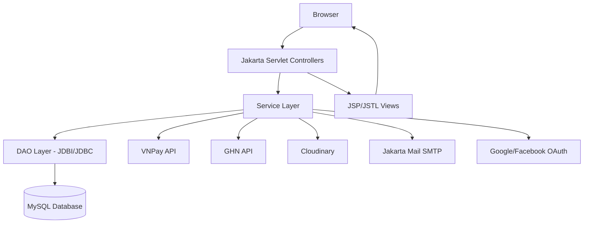
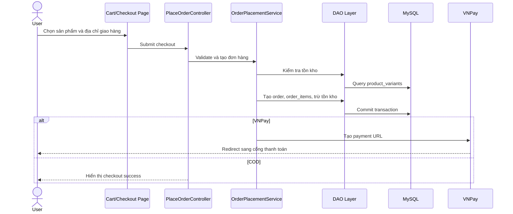
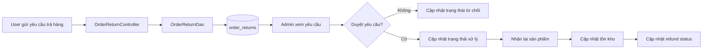
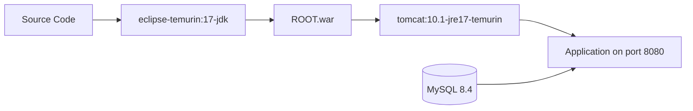

# Aura Studio - Fashion E-commerce Website

## Tóm tắt

Aura Studio là một website thương mại điện tử thời trang được xây dựng theo kiến trúc Java Web truyền thống với `Jakarta Servlet/JSP`, `JSTL`, `JDBI` và `MySQL`. Hệ thống hỗ trợ các nghiệp vụ chính của một cửa hàng trực tuyến như quản lý sản phẩm, giỏ hàng, đặt hàng, thanh toán VNPay, theo dõi vận chuyển GHN, quản lý yêu cầu trả hàng/hoàn tiền, quản trị nội dung và triển khai bằng Docker.

**Keywords:** Java Web, Jakarta Servlet, JSP, MVC, DAO, JDBI, MySQL, Docker, VNPay, GHN, E-commerce.

## 1. Giới thiệu

### 1.1. Mục tiêu

Dự án được phát triển nhằm mô phỏng một hệ thống e-commerce hoàn chỉnh cho cửa hàng thời trang, bao gồm cả phía người dùng và phía quản trị. Trọng tâm của hệ thống là xử lý đúng vòng đời đơn hàng, đồng bộ tồn kho, tích hợp thanh toán trực tuyến và hỗ trợ vận hành qua môi trường Docker.

### 1.2. Phạm vi

Hệ thống bao gồm:

- Website mua sắm cho khách hàng.
- Admin dashboard để quản lý sản phẩm, danh mục, đơn hàng, người dùng, blog, banner, liên hệ và yêu cầu trả hàng.
- Tích hợp dịch vụ bên ngoài gồm VNPay, GHN, Google OAuth, Facebook Login, Cloudinary và email OTP.
- Cấu hình triển khai bằng Docker, Docker Compose, Tomcat và MySQL.

## 2. Thông tin dự án

| Mục | Nội dung |
| --- | --- |
| Tên dự án | Aura Studio - Fashion E-commerce Website |
| Loại dự án | Java Web Application |
| Ngôn ngữ chính | Java 17 |
| Kiến trúc | MVC, Service Layer, DAO Pattern |
| Build tools | Gradle, Maven |
| Runtime | Apache Tomcat 10.1 |
| Database | MySQL 8.4 |
| Deployment | Docker, Docker Compose |
| Repository | https://github.com/DucPhat0311/ThucTapWeb-2026 |

## 3. Tech Stack

### 3.1. Backend

- Java 17
- Jakarta Servlet 6
- Jakarta Server Pages
- JSTL
- JDBI 3
- Jackson Databind
- Jakarta Mail
- BCrypt
- Logback

### 3.2. Frontend

- JSP/JSTL
- HTML5
- CSS3
- JavaScript
- Admin/User JSP views

### 3.3. Database

- MySQL 8.4
- SQL schema và seed data trong `database/aurastudio.sql`
- DAO Pattern với JDBI/JDBC

### 3.4. Third-party Integrations

- VNPay sandbox payment
- GHN shipping API
- Google OAuth
- Facebook Login thông qua RestFB
- Cloudinary image upload
- Email OTP thông qua Jakarta Mail

### 3.5. DevOps

- Docker
- Docker Compose
- Tomcat 10.1 JRE 17
- WAR deployment
- Environment variables
- Gradle SSH deploy task

## 4. Kiến trúc hệ thống

Hệ thống được tổ chức theo mô hình nhiều lớp. `Controller` tiếp nhận request từ client, gọi `Service` để xử lý business logic, sau đó truy cập dữ liệu thông qua `DAO`. View được render bằng JSP/JSTL.



## 5. Cấu trúc thư mục

```text
.
├── database/
│   └── aurastudio.sql
├── src/
│   └── main/
│       ├── java/
│       │   ├── controller/
│       │   ├── dao/
│       │   ├── filter/
│       │   ├── model/
│       │   ├── service/
│       │   └── util/
│       ├── resources/
│       │   ├── db.properties
│       │   ├── local.properties.example
│       │   ├── google-oauth.properties
│       │   └── vnpay.properties
│       └── webapp/
│           ├── WEB-INF/
│           │   ├── admin/
│           │   ├── auth/
│           │   ├── include/
│           │   └── views/
│           ├── css/
│           ├── js/
│           └── img/
├── Dockerfile
├── docker-compose.yml
├── build.gradle
├── pom.xml
└── README.md
```

## 6. Các chức năng chính

### 6.1. Người dùng

- Đăng ký, đăng nhập, đăng xuất.
- Xác thực OTP qua email.
- Đăng nhập bằng Google và Facebook.
- Cập nhật thông tin cá nhân, avatar, email và mật khẩu.
- Quản lý địa chỉ giao hàng.
- Xem danh sách sản phẩm, tìm kiếm, lọc và xem chi tiết sản phẩm.
- Quản lý giỏ hàng và wishlist.
- Checkout bằng COD hoặc VNPay.
- Xem lịch sử đơn hàng và chi tiết đơn hàng.
- Thanh toán lại đơn VNPay còn hạn.
- Hủy đơn hàng theo điều kiện hợp lệ.
- Mua lại đơn hàng đã hủy hoặc đã hoàn thành.
- Gửi yêu cầu trả hàng trong thời hạn hợp lệ.

### 6.2. Quản trị

- Quản lý sản phẩm, biến thể sản phẩm, hình ảnh, danh mục, màu sắc và kích thước.
- Quản lý người dùng, vai trò và quyền truy cập.
- Quản lý đơn hàng và trạng thái đơn hàng.
- Tạo và đồng bộ vận đơn GHN.
- Theo dõi hành trình vận chuyển mô phỏng.
- Quản lý yêu cầu trả hàng và trạng thái hoàn tiền.
- Quản lý tồn kho, nhập kho, xuất kho và hoàn kho.
- Quản lý banner, blog và liên hệ khách hàng.
- Dashboard thống kê doanh thu, đơn hàng và lợi nhuận.

### 6.3. Thanh toán và vận chuyển

- Tạo payment URL cho VNPay sandbox.
- Xử lý VNPay callback tại endpoint `/vnpay-return`.
- Kiểm tra trạng thái đơn VNPay đang chờ thanh toán.
- Hoàn kho khi đơn VNPay hết hạn hoặc bị hủy.
- Tạo vận đơn GHN từ trang quản trị.
- Đồng bộ trạng thái giao hàng từ GHN.
- Hủy vận đơn GHN khi đơn hàng bị hủy.

## 7. Luồng nghiệp vụ tiêu biểu

### 7.1. Luồng checkout



### 7.2. Luồng trả hàng/hoàn tiền



## 8. Database

Database chính được định nghĩa tại `database/aurastudio.sql`. Một số nhóm bảng quan trọng:

- User/Auth: `users`, `roles`, `role_permissions`
- Product catalog: `products`, `product_variants`, `product_images`, `categories`, `colors`, `sizes`, `tags`
- Cart/Order: `carts`, `cart_items`, `orders`, `order_items`
- Payment/Shipping: `payment_transactions`, `order_tracking`, `order_tracking_logs`
- Return/Refund: `order_returns`
- Inventory: `inventory_receipts`, `inventory_receipt_details`
- Content: `blogs`, `banners`, `contacts`, `reviews`, `wishlists`

## 9. Cài đặt và chạy dự án

### 9.1. Yêu cầu môi trường

- JDK 17
- Docker và Docker Compose
- MySQL 8.4 nếu chạy thủ công không qua Docker
- Apache Tomcat 10.1 nếu deploy WAR thủ công
- Gradle Wrapper hoặc Maven Wrapper có sẵn trong repository

### 9.2. Chạy bằng Docker Compose

1. Tạo file `.env` từ `.env.example`.

```bash
cp .env.example .env
```

2. Cập nhật tối thiểu biến sau trong `.env`.

```env
MYSQL_ROOT_PASSWORD=your_password
```

3. Khởi động hệ thống.

```bash
docker compose up --build
```

4. Truy cập ứng dụng.

```text
http://localhost:8080
```

Docker Compose sẽ tự khởi tạo MySQL, import `database/aurastudio.sql`, build WAR và chạy ứng dụng trên Tomcat.

### 9.3. Chạy local bằng IDE

1. Tạo database MySQL tên `aurastudio`.
2. Import file `database/aurastudio.sql`.
3. Copy file cấu hình local.

```bash
cp src/main/resources/local.properties.example src/main/resources/local.properties
```

4. Cập nhật thông tin database và các integration key nếu cần.

```properties
DB_HOST=localhost
DB_PORT=3306
DB_NAME=aurastudio
DB_USER=root
DB_PASS=your_password
```

5. Build project.

```bash
./gradlew clean war
```

Hoặc trên Windows:

```powershell
.\gradlew.bat clean war
```

6. Deploy file WAR trong `build/libs/ROOT.war` lên Tomcat 10.1.

## 10. Cấu hình môi trường

Các biến môi trường quan trọng:

| Biến | Mô tả |
| --- | --- |
| `MYSQL_ROOT_PASSWORD` | Mật khẩu root cho MySQL container |
| `DB_HOST` | Host database |
| `DB_PORT` | Port database |
| `DB_NAME` | Tên database |
| `DB_USER` | Database user |
| `DB_PASS` | Database password |
| `CLOUDINARY_CLOUD_NAME` | Cloudinary cloud name |
| `CLOUDINARY_API_KEY` | Cloudinary API key |
| `CLOUDINARY_API_SECRET` | Cloudinary API secret |
| `VNPAY_TMN_CODE` | VNPay terminal code |
| `VNPAY_HASH_SECRET` | VNPay hash secret |
| `VNPAY_PAY_URL` | VNPay payment endpoint |
| `VNPAY_RETURN_URL` | VNPay callback URL |
| `GOOGLE_CLIENT_ID` | Google OAuth client ID |
| `GOOGLE_CLIENT_SECRET` | Google OAuth client secret |
| `FACEBOOK_APP_ID` | Facebook app ID |
| `FACEBOOK_APP_SECRET` | Facebook app secret |
| `FACEBOOK_REDIRECT_URL` | Facebook OAuth redirect URL |
| `GHN_TOKEN` | GHN API token |
| `GHN_BASE_URL` | GHN API base URL |
| `GHN_SHOP_ID` | GHN shop ID |

## 11. Build và kiểm thử

### 11.1. Build bằng Gradle

```bash
./gradlew clean war
```

### 11.2. Build bằng Maven

```bash
./mvnw clean package
```

### 11.3. Chạy test

```bash
./gradlew test
```

Repository đã cấu hình JUnit 5. Nếu chưa có test case trong `src/test`, lệnh test chủ yếu dùng để xác nhận cấu hình build.

## 12. Deployment

Ứng dụng được đóng gói thành `ROOT.war` để deploy tại context root của Tomcat.

Dockerfile sử dụng multi-stage build:

1. Stage build: dùng `eclipse-temurin:17-jdk` để build WAR bằng Gradle.
2. Stage runtime: dùng `tomcat:10.1-jre17-temurin` để chạy ứng dụng.



## 13. Bảo mật và độ tin cậy

- Mật khẩu người dùng được hash bằng BCrypt.
- Cấu hình nhạy cảm được tách sang environment variables hoặc `local.properties`.
- Admin routes được bảo vệ bằng `AdminAuthFilter`.
- Checkout sử dụng transaction để giảm rủi ro tạo đơn lỗi hoặc trừ tồn kho sai.
- Có xử lý hoàn kho cho các trường hợp hủy đơn, thanh toán VNPay hết hạn hoặc hoàn hàng.
- Tích hợp status constants cho order/payment/return để tránh sai lệch trạng thái.

## 14. Đóng góp nổi bật

Một số nhóm đóng góp kỹ thuật quan trọng trong repository:

- Khởi tạo schema database và model cho domain e-commerce.
- Xây dựng các module user profile, address, checkout, order history và order detail.
- Tích hợp VNPay payment lifecycle gồm tạo payment URL, callback, failed payment, retry payment và expired payment handling.
- Tích hợp GHN shipping lifecycle gồm tạo vận đơn, theo dõi trạng thái, hủy vận đơn và demo tracking.
- Phát triển return/refund workflow cho người dùng và admin.
- Cải thiện tính nhất quán dữ liệu bằng transaction, stock validation và stock restoration.
- Chuẩn hóa deploy config bằng Docker, Docker Compose và environment variables.

## 15. Hạn chế và hướng phát triển

- Bổ sung automated test cho service và DAO layer.
- Tách REST API rõ hơn nếu phát triển frontend độc lập.
- Bổ sung CI/CD pipeline trên GitHub Actions.
- Bổ sung logging/auditing chi tiết cho nghiệp vụ thanh toán và hoàn tiền.
- Bổ sung migration tool như Flyway hoặc Liquibase.
- Nâng cấp phân quyền chi tiết hơn theo permission-based authorization.

## 16. Tài liệu tham khảo

[1] Oracle, "Java Platform, Standard Edition Documentation."  
[2] Eclipse Foundation, "Jakarta Servlet Specification."  
[3] Apache Tomcat, "Tomcat 10 Documentation."  
[4] JDBI, "JDBI 3 Developer Guide."  
[5] Docker, "Docker and Docker Compose Documentation."  
[6] VNPay, "VNPay Payment Gateway Integration Documentation."  
[7] GHN, "GHN Open API Documentation."

